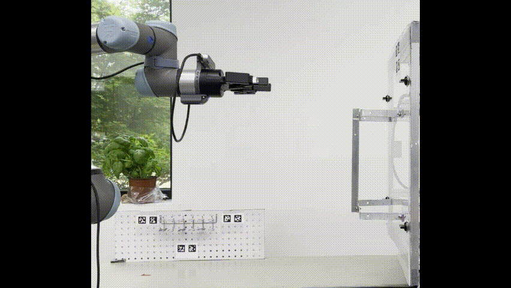
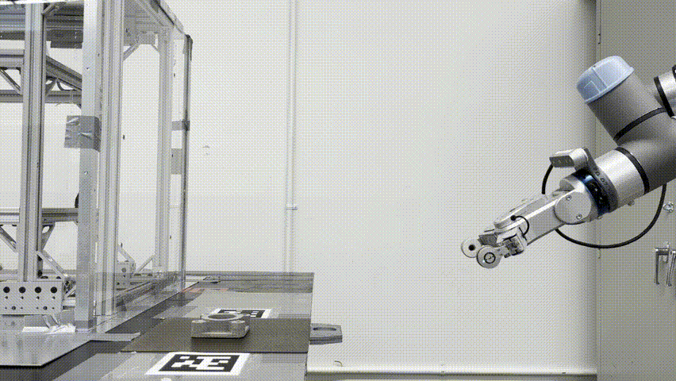
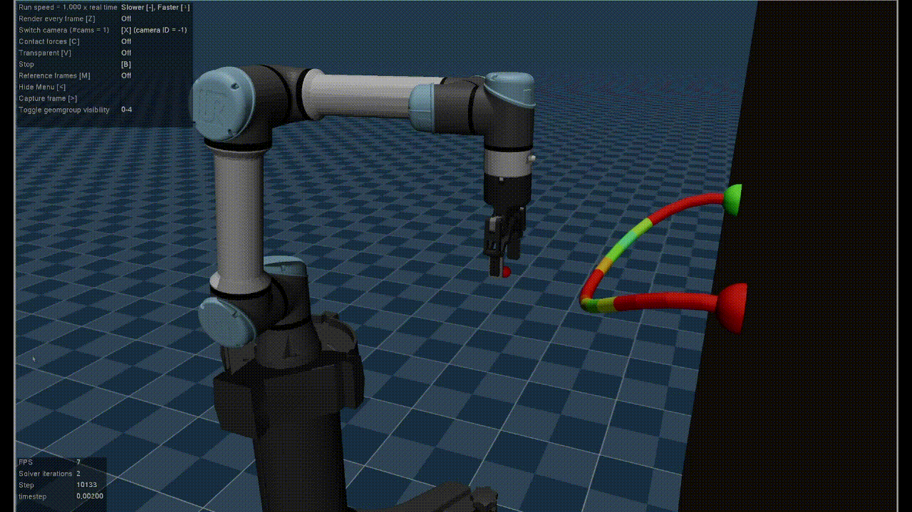
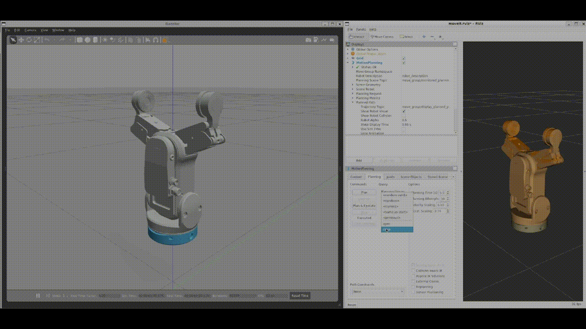

# Ian Chuang

## About Me

- 🏫 Studying Computer Science Engineering at UC Davis
- 🤖 Robotics Researcher at [LARA Lab](https://soltanilab.engineering.ucdavis.edu/) and [HRVIP Lab](https://hrvip.ucdavis.edu/)
- 💼 Former AI/ML Robotics Intern at Ford (Summer 2022)
- 💡 Interested in reinforcement learning, computer vision, simulation, and applying them to real robot control

Connect with me on [LinkedIn](https://www.linkedin.com/in/iantc104/)!

## Showcase

### ROS Environments

- #### [HOMESTRI-UR5e](https://github.com/tammerb/HOMESTRI-UR5e-Robotiq2f85/tree/minimal): ROS Workspace for UR5e Robots in HRVIP Lab and HOMESTRI
  
  

- #### [LARA-Aubo-Robot](https://github.com/ian-chuang/LARA_AUBOi5_AG95): ROS Environment for Aubo Robots in LARA Lab
  
  

- #### [space_habitat_robotics_framework](https://github.com/Drojas251/space_habitat_robotics_framework): ROS environment for vx300s robot arms
  

### Simulation

- #### [homestri-ur5e-rl](https://github.com/ian-chuang/homestri-ur5e-rl): Mujoco Environment for flexible manipulation in HRVIP
  

### ROS Controllers and Drivers

- #### [OnRobot-RG2FT-ROS](https://github.com/ian-chuang/OnRobot-RG2FT-ROS): ROS driver for OnRobot RG2-FT Gripper
  

- #### [robotiq](https://github.com/ian-chuang/robotiq): ROS driver for Robotiq 2F-85 Gripper
  

- #### [dh_gripper_ros](https://github.com/ian-chuang/dh_gripper_ros): ROS driver for DH Robotics AG95 Gripper

- #### [Interbotix_ViperX_300_ROS_Control](https://github.com/ian-chuang/Interbotix_ViperX_300_ROS_Control): ROS setup for dual VX300s arms

- #### [KWR75-Force-Sensor-ROS](https://github.com/ian-chuang/KWR75-Force-Sensor-ROS): ROS driver for KWR75 Force Torque Sensor

- #### [Low-Pass-Force-Torque-Sensor-Controller](https://github.com/ian-chuang/Low-Pass-Force-Torque-Sensor-Controller): Force torque sensor controller with low pass filter

- #### [Gazebo-Gripper-Action-Controller](https://github.com/ian-chuang/Gazebo-Gripper-Action-Controller): Action controller for grippers in Gazebo
  

### Web Development Projects

Although I'm currently focused on robotics, I've also ventured into web development. Here are some of my past projects:

- #### [Twitter-From-Scratch](https://github.com/ian-chuang/Twitter-From-Scratch): Twitter-like app built from scratch with ReactJS, Redux, and Firebase
  

- #### [AlgorithmVisualizer](https://github.com/ian-chuang/AlgorithmVisualizer): React app to visualize sorting, graph, and maze generation algorithms
  

### School Projects

I've been involved in various school projects as well:

- #### [Heart-Disease-Prediction](https://github.com/ian-chuang/Heart-Disease-Prediction): ECS171 Machine Learning group project to predict likelihood of heart disease

- #### [RoboFroggy](https://github.com/ian-chuang/RoboFroggy): ECS189L Group Project for a Unity 2D Side scrolling game
  

Feel free to explore these projects and get in touch with me if you have any questions or collaboration opportunities!
